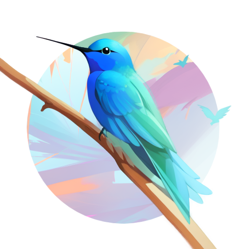

 
# Qinti UI

### This project will have it's first release around wednesday 24, April 2024, if the last round of testing goes well

Qinti UI is an open source frontend made with Godot for image generation that aims to be both easy to use and for profesional use

It also comes in the form of an executable, so the frontend itself doesn't need to be installed, just click and run, it is currently available for Linux and Windows

The project uses the AGPL license to ensure that it will always be free and open source

# Features

## Controlnet

## Inpaint, Outpaint and drawing to AI image

## Misc
    - Infinite canvas
    - Use of Textural inversion, LoRAs, Lycoris, etc
    - Model resources management
    - Supports both Automatic1111 Web UI and SD.Next as backends
    - Modular use of generated images metadata to generata other iamges
    - Inbuilt tutorials
    - Automatic1111 installation (beta feature)

# Getting Started

## Installation

## First steps
