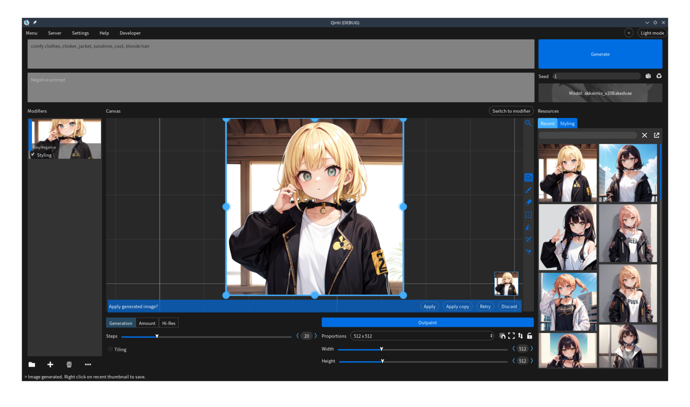
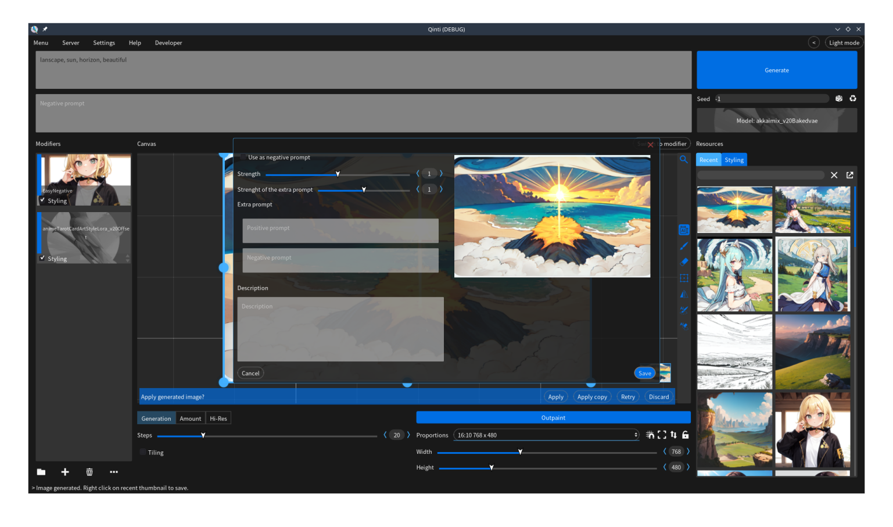

# Qinti UI

  
  

Qinti UI is an open source frontend made with Godot for image generation that aims to be both easy to use and for professional use.

It also comes in the form of an executable, so the frontend itself doesn't need to be installed, just click and run. It is currently available for Linux and Windows.

The project uses the AGPL license to ensure that it will always be free and open source.

# Features

## Controlnet

https://github.com/Samachiy/Qinti/assets/155751973/d2107449-9354-4364-b759-9bba1f4436c9

## Inpaint, Outpaint and drawing to AI image

https://github.com/Samachiy/Qinti/assets/155751973/84399745-4e89-4de7-b369-4d7b3b8baab7

## Misc
- Infinite canvas
- Use of Textural inversion, LoRAs, Lycoris, etc
- Model resources management
- Supports both Automatic1111 Web UI and SD.Next as backends
- Modular use of generated images metadata to generate other images
- Inbuilt tutorials
- Automatic1111 Web UI installation (beta feature)

https://github.com/Samachiy/Qinti/assets/155751973/fe350ae5-c6e2-4f8e-a0f4-d471179a1a51

# Getting Started

## Installation

### Windows

1. Download
2. Decompress tar file
3. Run Qinti.exe

### Linux

1. Download
2. Decompress zip file
3. Make Qinti.x86_64 executable
4. Run Qinti.x86_64

## First steps

To use Qinti, it is necessary to specify a Automatic1111 Web UI installation or let Qinti install one, both options will be shown during the first program run:
- On the first option it is necessary to open the installation path and maybe specify extra arguments. A set of arguments will automatically load depending on the system but if the specified arguments are not enough, it is possible to specify extra arguments.
- On the second option it is only necessary to specify an installation folder and press “install”.

After a valid installation is set, Qinti will display a few short tutorials to explain the user interface

# Modyfing code and compiling 

In case anyone wants to modify or compile the code by themselves, the instructions are as follows:

### Runnig the project

1. Clone this repo (don't run it yet):
   > git clone https://github.com/Samachiy/Qinti.git
   
2. Clone Guion addon:
   > git clone https://github.com/Samachiy/Guion.git
   
3. Copy Guion/addons into Qinti/
4. Download Godot from: https://godotengine.org/download/3.x/
5. Run the project

### Compiling

Follow the instructions in the official Godot Documentation: https://docs.godotengine.org/en/3.5/development/compiling/index.html
